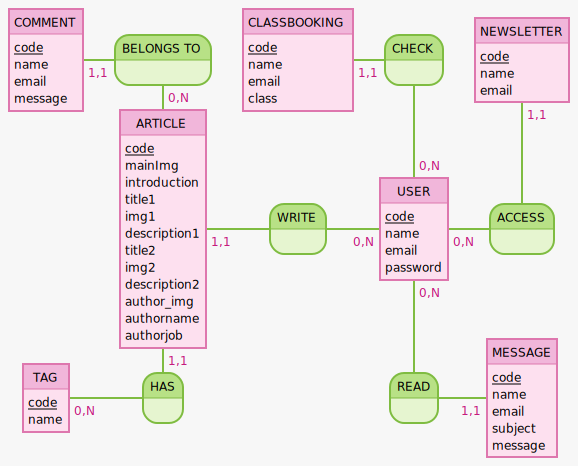

## MCD

- COMMENT : code, name, email, message  
- BELONGS TO , 0N ARTICLE, 11 COMMENT
- CLASSBOOKING : code, name, email, class
- CHECK, 0N USER, 11 CLASSBOOKING
- NEWSLETTER : code, name, email

- ARTICLE : code, mainImg, introduction, title1, img1, description1, title2, img2, description2, author_img, authorname, authorjob
- WRITE, 0N USER, 11 ARTICLE
- USER : code, name, email, password
- ACCESS, 0N USER, 11 NEWSLETTER
- TAG : code, name
- HAS , ON TAG, 11 ARTICLE
- READ, 0N USER, 11 MESSAGE
- MESSAGE : code, name, email, subject, message

## MLD

- COMMENT (_id_, name, email, message, #Article_id)
- CLASSBOOKING (_id_, name, email, class, #User_id)
- NEWSLETTER (_id_, name, email, #User_id)
- ARTICLE (_id_, mainImg, introduction, title1, img1, description1, title2, img2, description2, author_img, authorname, authorjob, .Tag, #User_id)
- USER (_id_, name, email, password)
- TAG (_id_, name)
- MESSAGE (_id_, name, email, subject, message, #User_id)

## MPD  

- "user"(
   - "id" INTEGER GENERATED ALWAYS AS IDENTITY PRIMARY KEY,  
   - "name" TEXT,  
   - "email" TEXT NOT NULL UNIQUE,  
   - "password" TEXT NOT NULL,  
)
- "article"(
    - "id" INTEGER GENERATED ALWAYS AS IDENTITY PRIMARY KEY,  
    - "mainImg" TEXT,  
    - "introduction" TEXT,  
    - "title1" TEXT,  
    - "img1" TEXT,  
    - "description1" TEXT,  
    - "title2" TEXT,  
    - "img2" TEXT,  
    - "description2" TEXT,  
    - "author_img" TEXT NOT NULL,  
    - "authorname" TEXT NOT NULL,  
    - "authorjob" TEXT NOT NULL,  
    - "tag_id" INTEGER NOT NULL REFERENCES "tag"("id"),  
    - "user_id" INTEGER NOT NULL REFERENCES "user"("id"),  
)
- "newsletterRequest"(
    - "id" INTEGER GENERATED ALWAYS AS IDENTITY PRIMARY KEY,  
    - "name" TEXT,  
    - "email" TEXT NOT NULL UNIQUE,  
    - "user_id" INTEGER NOT NULL REFERENCES "user"("id"),  
)
- "message"(
    - "id" INTEGER GENERATED ALWAYS AS IDENTITY PRIMARY KEY,  
    - "name" TEXT,  
    - "email" TEXT NOT NULL UNIQUE,  
    - "subject" TEXT,  
    - "message" TEXT,  
    - "user_id" INTEGER NOT NULL REFERENCES "user"("id"),  
)
- "classbooking"(
    - "id" INTEGER GENERATED ALWAYS AS IDENTITY PRIMARY KEY,  
    - "name" TEXT,  
    - "email" TEXT NOT NULL UNIQUE,  
    - "class"
    - "user_id" INTEGER NOT NULL REFERENCES "user"("id"),   
)
- "tag"( 
    - "id" INTEGER GENERATED ALWAYS AS IDENTITY PRIMARY KEY,  
    - "name" TEXT,  
),  
- "comment" (
    - "id" INTEGER GENERATED ALWAYS AS IDENTITY PRIMARY KEY,  
    - "name" TEXT,  
    - "email" TEXT NOT NULL UNIQUE,  
    - "message" TEXT,  
    - "article_id" INTEGER NOT NULL REFERENCES "article"("id"),  
);