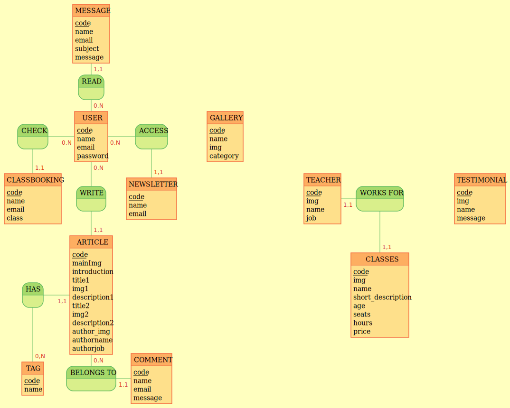

## MCD

- ACCESS, 0N USER, 11 NEWSLETTER
- NEWSLETTER : code, name, email
- MESSAGE : code, name, email, subject, message
- READ, 0N USER, 11 MESSAGE
- USER : code, name, email, password
- CHECK, 0N USER, 11 CLASSBOOKING
- CLASSBOOKING : code, name, email, class
- WRITE, 0N USER, 11 ARTICLE
- ARTICLE : code, mainImg, introduction, title1, img1, description1, title2, img2, description2, author_img, authorname, authorjob
- HAS , ON TAG, 11 ARTICLE
- BELONGS TO , 0N ARTICLE, 11 COMMENT
- TAG : code, name
- COMMENT : code, name, email, message
- TESTIMONIAL : code, img, name, message
- CLASSES : code, img, name, short_description, age, seats, hours, price
- WORKS FOR , 11 CLASSES, 11 TEACHER
- TEACHER : code, img, name, job
- GALLERY : code, img, name, category
  

## MLD

- COMMENT (_id_, name, email, message, #Article_id)
- CLASSBOOKING (_id_, name, email, class, #User_id)
- NEWSLETTER (_id_, name, email, #User_id)
- ARTICLE (_id_, mainImg, introduction, title1, img1, description1, title2, img2, description2, author_img, authorname, authorjob, .Tag, #User_id)
- USER (_id_, name, email, password)
- TAG (_id_, name)
- MESSAGE (_id_, name, email, subject, message, #User_id)
- CLASSES (_id_, img, name, short_description, age, seats, hours,price)
- TEACHER (_id_, img, name, job, #classes_id)
- TESTIMONIAL (_id_, img, name, message)
- GALLERY (_id_, img, name, category)
  
## MPD  

- "user"(
  - "id" INTEGER GENERATED ALWAYS AS IDENTITY PRIMARY KEY,  
  - "name" TEXT,  
  - "email" TEXT NOT NULL UNIQUE,  
  - "password" TEXT NOT NULL,  
)
- "classes"(
    "id" INTEGER GENERATED ALWAYS AS IDENTITY PRIMARY KEY,
    "img" TEXT,
    "name" TEXT NOT NULL,
    "short_description" TEXT,
    "age" TEXT NOT NULL,
    "seats" INTEGER NOT NULL,
    "hours" TEXT NOT NULL,
    "price" INTEGER NOT NULL,
)
- "teacher"(
    "id" INTEGER GENERATED ALWAYS AS IDENTITY PRIMARY KEY,
    "img" TEXT,
    "name" TEXT NOT NULL,
    "job" TEXT NOT NULL,
    "classes_id" INTEGER NOT NULL REFERENCES "classes"("id"),
    "created_at" timestamptz NOT NULL DEFAULT CURRENT_TIMESTAMP,
    "updated_at" timestamptz
)
- "article"(
  - "id" INTEGER GENERATED ALWAYS AS IDENTITY PRIMARY KEY,  
  - "mainImg" TEXT,  
  - "introduction" TEXT,  
  - "title1" TEXT,  
  - "img1" TEXT,  
  - "description1" TEXT,  
  - "title2" TEXT,  
  - "img2" TEXT,  
  - "description2" TEXT,  
  - "author_img" TEXT NOT NULL,  
  - "authorname" TEXT NOT NULL,  
  - "authorjob" TEXT NOT NULL,  
  - "tag_id" INTEGER NOT NULL REFERENCES "tag"("id"),  
  - "user_id" INTEGER NOT NULL REFERENCES "user"("id"),  
)
- "newsletterRequest"(
  - "id" INTEGER GENERATED ALWAYS AS IDENTITY PRIMARY KEY,  
  - "name" TEXT,  
  - "email" TEXT NOT NULL UNIQUE,  
  - "user_id" INTEGER NOT NULL REFERENCES "user"("id"),  
)
- "message"(
  - "id" INTEGER GENERATED ALWAYS AS IDENTITY PRIMARY KEY,  
  - "name" TEXT,  
  - "email" TEXT NOT NULL UNIQUE,  
  - "subject" TEXT,  
  - "message" TEXT,  
  - "user_id" INTEGER NOT NULL REFERENCES "user"("id"),  
)
- "classbooking"(
  - "id" INTEGER GENERATED ALWAYS AS IDENTITY PRIMARY KEY,  
  - "name" TEXT,  
  - "email" TEXT NOT NULL UNIQUE,  
  - "class"
  - "user_id" INTEGER NOT NULL REFERENCES "user"("id"),
)
- "tag"(
  - "id" INTEGER GENERATED ALWAYS AS IDENTITY PRIMARY KEY,  
  - "name" TEXT,  
),  
- "comment" (
  - "id" INTEGER GENERATED ALWAYS AS IDENTITY PRIMARY KEY,  
  - "name" TEXT,  
  - "email" TEXT NOT NULL UNIQUE,  
  - "message" TEXT,  
  - "article_id" INTEGER NOT NULL REFERENCES "article"("id"),  
)
- "testimonial" (
    "id" INTEGER GENERATED ALWAYS AS IDENTITY PRIMARY KEY,
    "img" TEXT,
    "name" TEXT NOT NULL,
    "message" TEXT NOT NULL,
    "created_at" timestamptz NOT NULL DEFAULT CURRENT_TIMESTAMP,
    "updated_at" timestamptz
);
"gallery" (
    "id" INTEGER GENERATED ALWAYS AS IDENTITY PRIMARY KEY,
    "name" TEXT,
    "img" TEXT NOT NULL,
    "category" TEXT NOT NULL,
    "created_at" timestamptz NOT NULL DEFAULT CURRENT_TIMESTAMP,
    "updated_at" timestamptz
);
