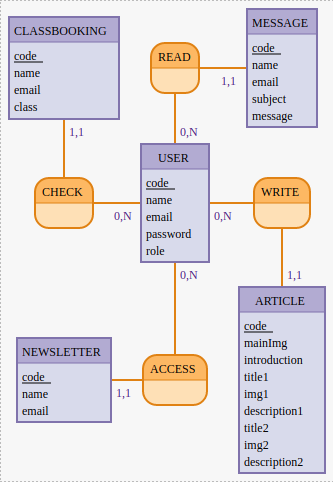

## MCD

- CLASSBOOKING : code, name, email, class
- READ, 0N USER, 11 MESSAGE
- MESSAGE : code, name, email, subject, message

- CHECK, 0N USER, 11 CLASSBOOKING
- USER : code, name, email, password, role
- WRITE, 0N USER, 11 ARTICLE

- NEWSLETTER : code, name, email
- ACCESS, 0N USER, 11 NEWSLETTER
- ARTICLE : code, mainImg, introduction, title1, img1, description1, title2, img2, description2

## MLD

- ARTICLE ( code, mainImg, introduction, title1, img1, description1, title2, img2, description2 , #codeUser)
- NEWSLETTER ( code, name, email, #codeUser )
- USER ( code, name, email, password, role)
- MESSAGE ( code, name, email, subject, message, #codeUser )
- CLASSBOOKING ( code, name, email, class, #codeUser )

## MPD  
=> "role" deleted in "user" and "newsletter" changed to "newsletterRequest"

- "user"(
    "id" INTEGER GENERATED ALWAYS AS IDENTITY PRIMARY KEY,
    "name" TEXT,
    "email" TEXT NOT NULL UNIQUE,
    "password" TEXT NOT NULL,
)
- "article"(
    "id" INTEGER GENERATED ALWAYS AS IDENTITY PRIMARY KEY,
    "mainImg" BYTEA,
    "introduction" TEXT,
    "title1" TEXT,
    "img1" BYTEA,
    "description1" TEXT,
    "title2" TEXT,
    "img2" BYTEA,
    "description2" TEXT,
    "user_id" INTEGER NOT NULL REFERENCES "user"("id"),
)
- "newsletterRequest"(
    "id" INTEGER GENERATED ALWAYS AS IDENTITY PRIMARY KEY,
    "name" TEXT,
    "email" TEXT NOT NULL UNIQUE,
    "user_id" INTEGER NOT NULL REFERENCES "user"("id"),
)
- "message"(
    "id" INTEGER GENERATED ALWAYS AS IDENTITY PRIMARY KEY,,
    "name" TEXT,
    "email" TEXT NOT NULL UNIQUE,
    "subject" TEXT,
    "message" TEXT,
    "user_id" INTEGER NOT NULL REFERENCES "user"("id"),
)
- "classbooking"(
    "id" INTEGER GENERATED ALWAYS AS IDENTITY PRIMARY KEY,
    "name" TEXT,
    "email" TEXT NOT NULL UNIQUE,
    "class"
    "user_id" INTEGER NOT NULL REFERENCES "user"("id"), 
)
