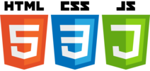

Here's a project for a -non-existing- school : **_KiddyCare_** !  

A website giving the possibilities to users to check what the school has to offer, check their news through a blog and interact with the administration.  
Indeed, the targeted users (parents) can get details about the school through the different pages, request a Newsletter, book a class,leave comments for each articles posted in the school blog and leave a message.  
To access to all of those requests from users, the school manager and teachers have a back-office part. They don't have the same rights though : the school manager (admin) can access to everything whereas the teachers can only create/remove articles and related comments.   

I coded the front-end with HTML, CSS and Vanilla Javascript following the design of a template (link of copyrights are in the footer). I didn't use any code given in the template.  
Some animations were added like the apparition of elements on scroll or the testimonial slide.  
The project is fully responsive, some elements as the menu change with the size screen.  

For the back-end part, I used NodeJS with Express. The architecture used is a MVC. For the datas, I used a relational database system : Postgres . To access to those datas, I used Sequelize and made the views with EJS.  

The project is deployed on Heroku at this adress : [kiddycare.herokuapp.com](https://kiddycare.herokuapp.com/)    

    